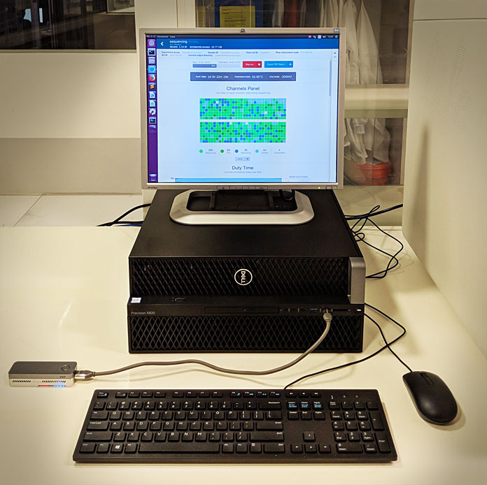

# Holt Lab MinION desktop

This repo contains scripts and programs for the Holt Lab's MinION-running computer. This computer is a fairly beefy desktop that (thanks to its GTX 1080 GPU) can demultiplex with [Deepbinner](https://github.com/rrwick/Deepbinner) and basecall with Guppy.

<p align="center"></p>

The contents of these repo are custom-tailored to our setup and workflow (i.e. I make no promises that they may work for you), but I made them publicly available in case others are interested!


### basecall.py

This is the script we use to do real time basecalling. I.e. we run MinKNOW with live basecalling turned _off_ and use this script to do Guppy basecalling during the run. This gives a few advantages over live basecalling in MinKNOW:

* It lets us do GPU basecalling (much faster than using the CPU).
* It lets us use Guppy features not yet present in MinKNOW (like demultiplexing and barcode trimming).
* It concatenates the results so we get one final fastq file per barcode bin.
* It displays barcode distribution and translocation speed stats as it goes.

It needs to be run with the input directory (where fast5s are deposited), an output directory, which barcodes were used and which basecalling model to use:
```
basecall.py -i fast5 -o fastq --barcodes native_1-12 --model r9.4_hac
```

It needs a couple of external packages to run: [dateutil](https://pypi.org/project/python-dateutil/) and [h5py](https://pypi.org/project/h5py/).


### fast_count

This is a little C program that reports some basic stats on a fastq/fasta file: the number of reads, the total size (in bp) and read length metrics: N99, N90, N50, N10 and N01 lengths. I threw it together using [this example](https://bioinformatics.stackexchange.com/a/937) as a starting point. Because it uses the wonderful [kseq.h](http://attractivechaos.github.io/klib/#Kseq%3A%20stream%20buffer%20and%20FASTA%2FQ%20parser) header file, it's very fast.

To build it, just run `make` in this repo's directory.

Run it with no arguments to make it print the tab-delimited header. Run it with fasta or fastq arguments to get the stats. Multiple input files are fine – each will get a single line of output.


### Setup

The [setup.md](setup.md) file contains my crude notes on setting up the software on the desktop. They are not exhaustive and some of the steps are applicable only to our computer/environment.


### License

[GNU General Public License, version 3](https://www.gnu.org/licenses/gpl-3.0.html)
